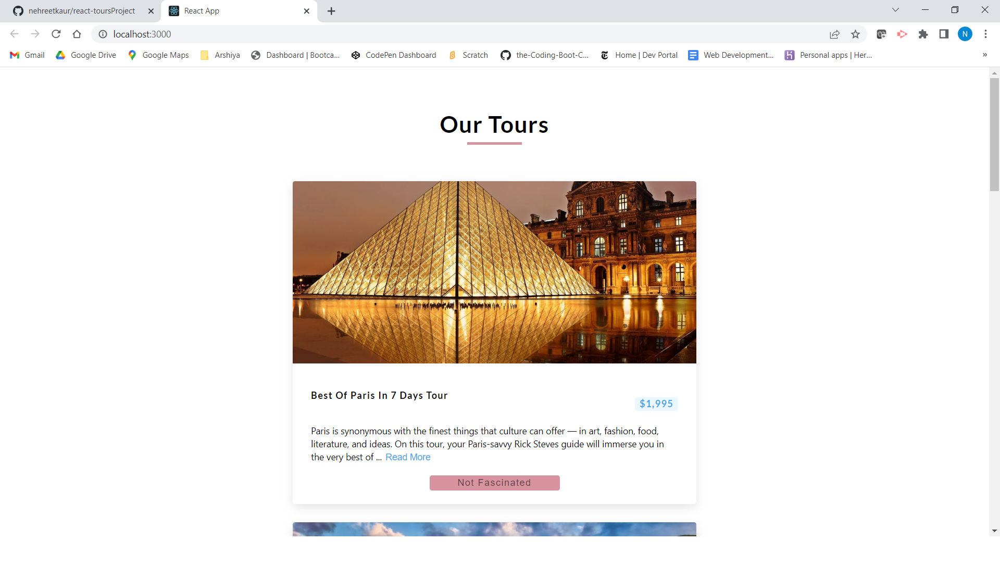
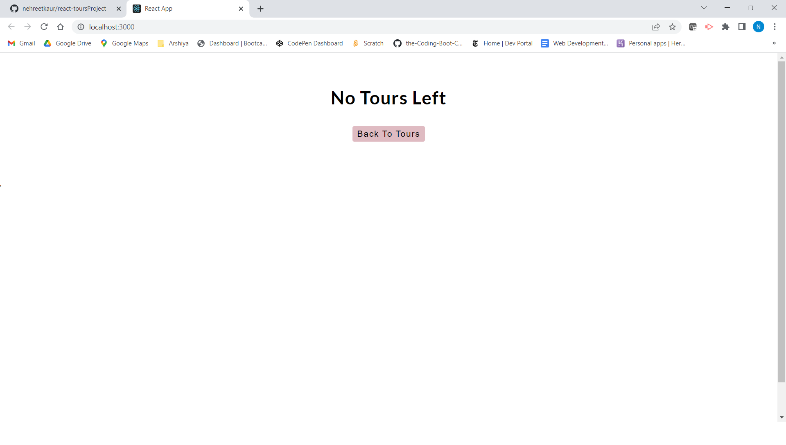

# About

**Developed** an application about tours and their information.
This application I created while I was learning from React projects from FreeCode Camp. I have used the same API which was
used in the tutorial.

# TABLE OF CONTENTS
[ Description](#Description)

[INSTALLATION](#INSTALLATION)

[TEXT-EDITOR](#TEXT-EDITOR)

[PROGRAMMING-LANGUAGE](#PROGRAMMING-LANGUAGE)

[RESOURCES-REFERRED](#RESOURCES-REFERRED)

[SCREENSHOT](#SCREENSHOT)

[GIT_HUB-REPOSITORY](#GIT_HUB-REPOSITORY)

[Heroku-Deployed-Link](#GIT_HUB-Deployed-Link)

# Description
Created an application , about tours. I got inspired while I
was learning from Freecode camp react tutorial and I have made while I was learning.Created different components and also used the state hook. User can get information about tours and price,also user can read more information by clicking on the show more button. I have learned so many new things and I have used the sameAPI which was used in the tutorial. Big thank you to freecode camp.Also, if user is not interested , can remove the tour from the list and if no tours left in the list user can go back to the tours list to explore them again.

# INSTALLATION

**npx create-react-app<appname>**

## TEXT-EDITOR
**Vs-code**

## PROGRAMMING-LANGUAGE

REACT

CSS

JAVASCRIPT

HTML 

# RESOURCES-REFERRED

[React-Documentation](https://reactjs.org/docs/hooks-state.html)

[React-Documentation](https://reactjs.org/docs/components-and-props.html)

[Tutorial](https://www.youtube.com/watch?v=a_7Z7C_JCyo&t=4665s)

[Colors](https://coolors.co/palettes/trending)

# SCREENSHOT

# GIT_HUB-REPOSITORY
[GIT-HUB](https://github.com/nehreetkaur/react-toursProject)

# Heroku-Deployed-Link
[Heroku](https://react-toursproject.herokuapp.com/)